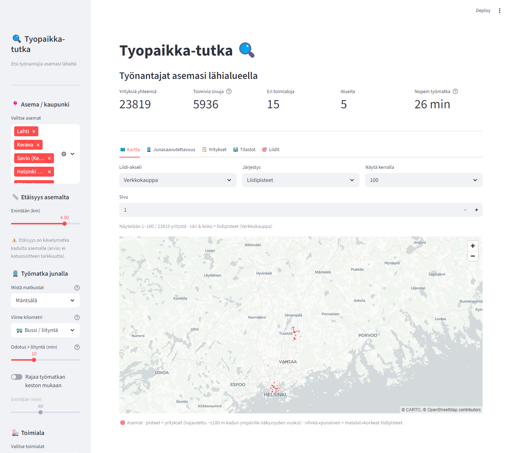
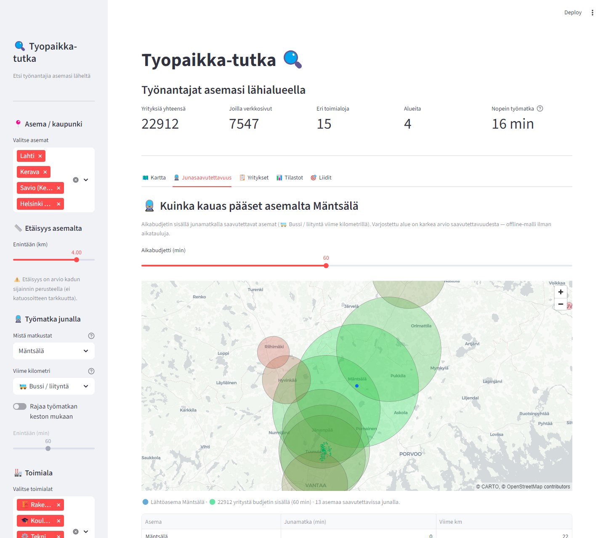

# Tyopaikka-tutka — hiring signal scanner

This repo finds hiring signals from company websites near Finnish railway stations.
The data backbone is the PRH business registry (open data, permanent), enriched with
Photon geocoding and optionally Google Places. Companies are classified by industry
using Finnish TOI (NACE Rev2) codes.

## Public dashboard

A ready-to-use Streamlit dashboard is included (`streamlit_app.py`). Anyone can:
- Choose a city / railway station
- Set how far they are willing to travel (km)
- Filter by industry
- See the **train commute time** to each employer from a chosen home station
  (default Mäntsälä) — train time + last-mile walk/bike/bus — and cap results
  by minutes
- Explore **how far you can get by train** within a time budget (isochrone)
- Browse leads on an interactive map and download results as CSV



The **Kartta** (map) tab is filled from lead scoring: pick a service axis
(Verkkokauppa / PIM / Data) and each company is coloured (green→red) and sized
by its lead score. Sort by lead score, by city (station), or closest, and page
through the results (100/250/500/1000/all) — so you can browse e.g. the top
100 leads of Kerava, then the next 100. The same scoring drives the **Liidit**
(leads) tab.

The **Junasaavutettavuus** (train reach) tab shows the area reachable from your
home station within a time budget: green disks are the reachable station areas
and green dots are employers inside the budget.



The commute estimate is a self-contained, offline model (`src/apprscan/transit.py`):
a small calibrated rail network routed with Dijkstra — no API key or timetable
download, so it runs as-is on Streamlit Cloud.

### Run locally
```
pip install -r requirements.txt
streamlit run streamlit_app.py
```

### Deploy to Streamlit Community Cloud (free)
1. Fork this repo on GitHub
2. Go to [share.streamlit.io](https://share.streamlit.io) → "New app"
3. Select your fork, branch `master` — `streamlit_app.py` is picked up automatically
4. Click Deploy — no configuration needed, data is committed in `out/companies.csv`

## Covered areas
Lahti, Kerava, Savio, Pasila, Tikkurila — ~3 km radius from each railway station.

## Pipeline

### 1. Street discovery (one-time, cached)
Fetches named roads within the station radius from OpenStreetMap via Overpass API.
```
python scripts/discover_streets.py --radius-m 3000
```
Output: `data/area_streets.json`

### 2. PRH registry fetch
Downloads all active companies from the PRH open-data API filtered by station area streets.
Passive shell companies (Asunto Oy, Kiinteistö Oy, TOI 6820x) are excluded automatically.
```
python scripts/fetch_prh_area.py --areas Lahti Kerava Savio Pasila --out data/prh_registry.parquet
```
Output: `data/prh_registry.parquet` (~13,600 raw companies)

### 3. Geocode & filter
Resolves company postcodes to coordinates via Photon (no API key needed), filters by
distance to station, and writes the enriched dataset. Use `--no-filter-passive` to keep
housing companies.
```
python scripts/enrich_google.py --max-distance-km 3 --areas Lahti Kerava Savio Pasila
```
Output: `out/enriched_prh.parquet`

### 3a. Build companies.csv
Projects the enriched parquet (raw PRH column names) into the dashboard schema
(`address`, `toi_code`, `toi_description`, `registered`, …).
```
python scripts/build_companies_csv.py
```
Output: `out/companies.csv` (~26,000 companies with industry labels and coordinates)

### 3b. Street-level geocoding (recommended)
The base geocode resolves one point per postcode, which collapses every company
in an area onto a single coordinate. This step re-geocodes each unique
`street + postcode` via Photon (station-biased, street-name matched, cached in
`data/street_cache.sqlite`) and recomputes `distance_km` in place, so distances
and commute times vary per company. Street-centroid accuracy (PRH addresses have
no house numbers); each row gets a `geocode_quality` flag.
```
python scripts/geocode_streets.py
```

### 3c. Road-distance last mile (recommended)
Straight-line distance underestimates the real walk. This computes the
shortest-path walking distance from each company to its station over the OSM
walking network (via OSMnx) and writes `road_distance_km`, which the commute
estimate uses for the last mile. OSM downloads are cached in `data/osmnx_cache`
and results in `data/road_distance_cache.sqlite`. Build-only (needs `osmnx`); the
deployed app just reads the column.
```
python scripts/road_distances.py
```

### 3d. Website liveness (recommended)
Probes each company's website and records `website_status` (`live` / `parked` /
`unreachable`) — a quick "is this a real, active company" signal (no LLM). Cached
in `data/website_health.sqlite`; the dashboard can filter to live sites only.
```
python scripts/website_health.py
```

### 4. Analysis
```
python scripts/analyze_companies.py
```

### 5. Hiring-signal scan (Ollama)
Scans company websites for active hiring signals using a local LLM.
```
python -m apprscan scan --station Lahti --max-distance-km 1.0 --limit 50 --out out/hiring_signal_lahti_50.csv
```

## Key output: `out/companies.csv`
Columns: `name`, `business_id`, `industry`, `toi_code`, `toi_description`, `nearest_station`,
`distance_km`, `road_distance_km`, `address`, `website`, `status`, `registered`, `lat`, `lon`,
`geocode_quality`, `website_status`

Industry groups: `it`, `construction`, `wholesale`, `marketing`, `health`, `manufacturing`,
`logistics`, `finance`, `retail`, `hospitality`, `education`, `engineering`, `staffing`,
`real_estate`, `other`

## Legacy flow (Google Places based)
1) Build a master from Places CSVs
   - `python scripts/places_to_master.py --station "Lahti,60.9836,25.6577,out/places_lahti.csv" --out out/master_places.xlsx`
2) Optional: curate in Streamlit (internal editor)
   - `streamlit run curate_app.py`
3) Build domains from Places websites
   - `python -m apprscan domains --companies out/master_places.xlsx --out domains.csv`

## Quality gate
- Run the one-button check before shipping or sharing outputs:
  - `python -m apprscan check`

## What the Ollama scan does
- Filters companies by nearest station and distance.
- Picks 1-2 candidate URLs (homepage + careers hint if found).
- Fetches those pages and uses heuristics with LLM fallback to classify: `yes`, `no`, or `unclear`.
- Requires 2-6 evidence snippets + URLs for `yes`/`no` or downgrades to `unclear`.
- Writes a CSV with signals, confidence, evidence, and any HTTP errors.

## Outputs
- `out/master_places.xlsx` (Shortlist + Excluded)
- `domains.csv` (business_id, name, domain)
- `out/hiring_signal_lahti.csv` / `out/hiring_signal_lahti_50.csv`
- Output schema: `schemas/hiring_signal_output.schema.json`

## Results (latest run)
- Lahti, 1 km radius, 50 companies: yes=9, no=14, unclear=27
- Output file: `out/hiring_signal_lahti_50.csv`

## Evaluation harness
- Run heuristic checks against stored HTML fixtures:
  - `python -m apprscan.evaluate_hiring_signal`

## Deterministic mode
- Use `--deterministic` to set temperature to 0 for more reproducible LLM output.
- Output provenance includes `ollama_model`, `ollama_temperature`, `prompt_version`, and `tool_version`.

## Companion service (optional)
- Install server dependencies:
  - `pip install -e .[server]`
- Run the local service (localhost-only by default):
  - `apprscan serve --host 127.0.0.1 --port 8787`
- The service prints `APPRSCAN token: ...` which must be sent as `X-APPRSCAN-TOKEN`.
- Optional env controls:
  - `APPRSCAN_CORS_ORIGINS` (comma-separated allowed origins)
  - `APPRSCAN_RATE_LIMIT_MAX` (per-token requests / window, default 10)
  - `APPRSCAN_RATE_LIMIT_WINDOW_S` (seconds, default 60)
  - `APPRSCAN_MAX_BODY_BYTES` (default 10240)
  - `APPRSCAN_RETENTION_DAYS` (default 30)
- Endpoints:
  - `POST /ingest/maps` with `{ "maps_url": "https://www.google.com/maps/..." }`
  - `GET /result/{run_id}`
- Company package schema: `src/apprscan/schemas/company_package.schema.json`
- Output files per run: `out/runs/<run_id>/company_package.json` and `company_package.md`
- Status mapping:
  - `ok`: website resolved, scan completed.
  - `degraded`: expected limitation (missing website, cookie wall, robots/JS-only).
  - `error`: invalid request or upstream failure.

## Requirements
- Python environment (see install below)
- Local Ollama running
- Configure Ollama via environment variables or repo `.env` (see `.env.example`)

## Install
```
python -m venv .venv && .\.venv\Scripts\activate
pip install -e .[dev]
```

## Optional (heavy): full jobs crawl
If you want actual job listings, the jobs crawler is still available, but it is slower.
```
python -m apprscan jobs --companies out/master_places.xlsx --domains domains.csv --out out/jobs_places --max-domains 50 --max-pages-per-domain 5
```

## Config and docs
- Industry groups: `config/industry_groups.yaml`
- Profiles: `config/profiles.yaml`
- Workflow notes: `docs/WORKFLOW.md`
- Output contract: `docs/OUTPUT_CONTRACT.md`
